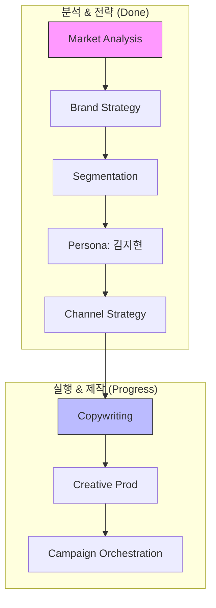

# Dante - Enterprise Agentic AI Ecosystem (종합 개발 보고서)

> **프로젝트**: Dante (Agentic School & Unified Skill Framework)
> **최종 업데이트**: 2026-05-15 [UPDATE]
> **작성자**: Antigravity (AI Coding Assistant)
> **저장소**: [https://github.com/git2583/git2583-dante](https://github.com/git2583/git2583-dante)

---

## 📌 목차

1. [프로젝트 개요 (Project Overview)](#1-프로젝트-개요-project-overview)
2. [전체 폴더 구조 아카이브 (Folder Structure Archive)](#2-전체-폴더-구조-아카이브-folder-structure-archive)
3. [마케팅 자동화 파이프라인 (Marketing Pipeline)](#3-마케팅-자동화-파이프라인-marketing-pipeline) [NEW]
4. [주요 구현 내용 및 기술 스택 (Implementation Details & Tech Stack)](#4-주요-구현-내용-및-기술-스택-implementation-details--tech-stack)
5. [일자별 상세 작업 로그 (Detailed Work Logs)](#5-일자별-상세-작업-로그-detailed-work-logs) [UPDATE]
6. [심층 트러블슈팅 (Advanced Troubleshooting)](#6-심층-트러블슈팅-advanced-troubleshooting)
7. [데이터베이스 및 보안 (Database & Security)](#7-데이터베이스-및-보안-database--security)
8. [향후 로드맵 (Next Steps & Roadmap)](#8-향후-로드맵-next-steps--roadmap)

---

## 1. 프로젝트 개요 (Project Overview)

**Dante**는 34개 이상의 전문 AI 스킬과 고도로 설계된 에이전트 그룹을 결합하여, 비즈니스 전략부터 실행(콘텐츠 제작, 보고서 생성)까지 전 과정을 자동화하는 **엔터프라이즈급 에이전틱 AI 시스템**입니다.

### 1.1. 주요 성과 (2026-05-15 기준)
- **Dante Coffee 마케팅 자동화 성공**: Phase 0(시장 분석)부터 Phase 5(카피라이팅)까지 AI 주도 하에 완료.
- **산출물 고도화**: 800라인 이상의 KI 표준 개발 로그(`marketing.md`) 및 전문 PPTX 전략 보고서 생성.
- **저장소 무결성**: 핵심 지침(`AGENTS.md`) 및 모든 분석 리포트(`reports/`, `brand/`) GitHub 동기화 완료.

---

## 2. 전체 폴더 구조 아카이브 (Folder Structure Archive)

```text
.
├── .claude/
│   ├── agents/                 # 20개 이상의 도메인별 에이전트 정의
│   ├── commands/               # 26개 이상의 실행 커맨드 (Playbooks)
│   └── skills/                 # 34개의 전문 AI 스킬셋 (pptx, docx, image-gen 등)
├── brand/                      # [NEW] 브랜드 전략 및 페르소나 산출물
│   ├── dante-coffee-brand-strategy-brief.md
│   ├── dante-coffee-persona-kim-jihyun.md
│   └── dante-coffee-social-strategy-kim-jihyun.md
├── reports/                    # [NEW] 시장 분석 및 프레젠테이션 리포트
│   ├── market-analysis/        # 한국 커피 시장 분석 데이터
│   └── presentations/          # 자동 생성된 전략 PPTX 슬라이드
├── samples/marketing/          # 마케팅 시나리오 및 초기 브리프
├── marketing.md                # 800+ 라인 규모의 마케팅 전용 상세 로그
├── AGENTS.md                   # 프로젝트 운영 지침 및 에이전트 명세
└── README.md                   # 본 문서 (종합 프로젝트 홈페이지)
```

---

## 3. 마케팅 자동화 파이프라인 (Marketing Pipeline) [NEW]

Dante Coffee의 '스페셜티 대중화' 전략을 수립하기 위한 7단계 파이프라인입니다.



---

## 4. 주요 구현 내용 및 기술 스택 (Implementation Details & Tech Stack)

### 4.1. 기술 스택
- **Automation**: OpenCode (Multi-Agent), n8n (Workflow)
- **Document Engine**: PptxGenJS, Markdown (KI Standard)
- **AI Models**: Claude 3.5 Sonnet, Gemini 2.5/3.1
- **Storage**: GitHub (Artifacts), Supabase (Data)

### 4.2. 마케팅 자동화 핵심 로직
- **Context-Aware Persona**: `persona-architect`를 통해 '강남 테크 직장인'의 24시간 루틴을 설계하고, 이를 모든 마케팅 카피의 기준으로 삼음.
- **Multi-Channel Synergy**: 인스타그램(브랜딩) - 네이버(지역 유입) - 카카오(리텐션)를 연동한 하이브리드 미디어 믹스 구축.
- **Auto-PPTX Skill**: 분석된 전략 데이터를 슬라이드 객체로 변환하여 실무용 보고서(`reports/presentations/`) 자동 생성.

---

## 5. 일자별 상세 작업 로그 (Detailed Work Logs) [UPDATE]

### 5.1. [최신] Dante Coffee 마케팅 전 페이즈 통합 실행
- **작업 일시**: 2026-05-15 01:00 ~ 03:00
- **작업 목표**: 브랜드 전략 수립부터 광고 카피 제작까지의 자동화 완결

#### [상세 실행 과정 (Execution Logs)]
```text
[01:11] Phase 0 시장 분석 리포트 (310 lines) 생성 완료
[01:56] Phase 1-2 브랜드 에센스 및 4대 고객 세그먼트 도출
[02:05] Phase 3 상세 페르소나 '김지현 PM' 프로파일링 완성
[02:15] Phase 4 소셜 채널 전략 및 주간 캘린더 설계
[02:24] [pptx] 김지현 타겟 전략 슬라이드 자동 생성
[02:55] Phase 5 인스타그램 광고 카피 3종 제작 완료
[03:00] [git] 전체 산출물 및 AGENTS.md 저장소 푸시 완료
```

---

## 6. 심층 트러블슈팅 (Advanced Troubleshooting)

### 6.1. PowerShell 환경변수 및 커맨드 인식 오류
- **현상**: bash 스타일의 `VAR=val` 구문 사용 시 `CommandNotFoundException` 발생.
- **해결**: PowerShell 전용 구문인 `$env:VAR = "val"`로 수정 가이드 제공 및 `opencode serve --port` 이중 대시 형식을 적용하여 서버 가동 정상화.

### 6.2. Bun Baseline & AVX2 이슈
- **현상**: 구형 CPU에서 Bun 실행 시 `Illegal instruction` 패닉 발생.
- **해결**: `OH_MY_OPENCODE_FORCE_BASELINE=1` 환경변수를 통해 CPU 호환성 모드 강제 적용.

---

## 7. 향후 로드맵 (Next Steps & Roadmap)

- **Phase 6**: AI 이미지 생성 엔진(`kie-image-generator`)을 활용한 광고 비주얼 제작.
- **Phase 7**: 캠페인 성과 측정 시뮬레이션 및 최종 마케팅 성과 대시보드 구축.
- **Enterprise**: `kiwoom-api`를 연동한 실시간 기업 공시-마케팅 상관관계 분석 에이전트 테스트.

---
**Dante Agentic School** - *AI와 인간이 협업하여 비즈니스의 새로운 차원을 엽니다.*
