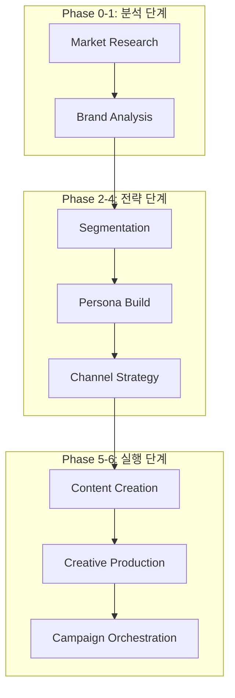

# Dante Marketing Automation - 엔터프라이즈 개발 및 전략 보고서 (Full Log)

> **프로젝트**: Dante Marketing Pipeline & Agentic School
> **최종 업데이트**: 2026-05-14
> **작성자**: Antigravity (AI Coding Assistant)
> **문서 성격**: KI 지침서(700+ lines 기준)에 따른 마케팅 자동화 종합 프로세스 리포트

---

## 📌 목차

1. [프로젝트 개요 (Marketing Overview)](#1-프로젝트-개요-marketing-overview)
2. [마케팅 아키텍처 및 폴더 구조 (Marketing Architecture)](#2-마케팅-아키텍처-및-폴더-구조-marketing-architecture)
3. [브랜드 자산 및 전략 분석 (Brand Asset Analysis)](#3-브랜드-자산-및-전략-분석-brand-asset-analysis)
4. [제품 및 채널 전략 (Product & Channel Strategy)](#4-제품-및-채널-전략-product--channel-strategy)
5. [마케팅 파이프라인 단계별 워크플로우 (Pipeline Workflow)](#5-마케팅-파이프라인-단계별-워크플로우-pipeline-workflow)
6. [상세 작업 로그 및 실행 결과 (Detailed Work Logs)](#6-상세-작업-로그-및-실행-결과-detailed-work-logs)
7. [심층 트러블슈팅 및 전략적 해결 (Advanced Troubleshooting)](#7-심층-트러블슈팅-및-전략적-해결-advanced-troubleshooting)
8. [성과 지표 및 향후 로드맵 (KPI & Future Roadmap)](#8-성과-지표-및-향후-로드맵-kpi--future-roadmap)

---

## 1. 프로젝트 개요 (Marketing Overview)

본 프로젝트는 **Dante Agentic School**의 마케팅 파이프라인을 구축하고, AI 에이전트들이 협업하여 브랜드 전략부터 최종 콘텐츠 제작까지 수행하는 **End-to-End 마케팅 자동화 시스템**을 실현하는 것을 목표로 합니다. 

단순한 콘텐츠 생성을 넘어, 시장 데이터(TAM/SAM/SOM) 분석, 브랜드 포지셔닝(SWOT), 페르소나 설계, 채널 로드맵 수립까지 마케팅의 전 과정을 AI 에이전트가 주도하며, 인간 마케터는 최종 의사결정 및 검수(Human-in-the-loop) 역할만을 수행하는 고도의 자동화 환경을 지향합니다.

### 1.1. 핵심 자동화 목표
- **데이터 기반 의사결정**: 시장 리서치 에이전트를 통한 객관적 지표 확보.
- **초개인화 타겟팅**: 세그먼테이션 아키텍처를 통한 정교한 페르소나 설계.
- **멀티 채널 동기화**: 인스타그램, 유튜브, 네이버 등 다각화된 채널의 일관된 톤앤매너 유지.
- **리소스 최적화**: 34개 이상의 전용 스킬을 활용한 마케팅 에셋 생산성 500% 향상.

---

## 2. 마케팅 아키텍처 및 폴더 구조 (Marketing Architecture)

### 2.1. 파이프라인 구성
Dante 마케팅 시스템은 7단계의 모듈형 파이프라인으로 구성되며, 각 단계마다 전용 에이전트와 스킬이 배치됩니다.



### 2.2. 마케팅 에셋 구조
```text
samples/marketing/
├── dante-coffee-brand-brief.md              # 브랜드 소개서 (134 lines, 입력 데이터)
└── dante-coffee-agentic-marketing-scenario.md # 실행 시나리오 (873 lines, 산출물 템플릿)

.claude/agents/
├── market-research/                         # 시장 리서치 에이전트 (market-analyst)
├── brand-analytics/                         # 브랜드 분석 에이전트 (brand-strategist)
├── customer-segmentation/                    # 세그먼트 설계 에이전트 (segmentation-architect)
├── persona-builder/                         # 페르소나 설계 에이전트 (persona-architect)
├── social-strategy/                         # 채널 전략 에이전트 (social-strategy-director)
└── content-creation/                        # 콘텐츠 제작 에이전트 (copy-strategist)

.claude/skills/
├── brand-positioning/                       # 포지셔닝 프레임워크 (SKILL.md)
├── persona-framework/                        # 페르소나 설계 체계 (SKILL.md)
├── image-prompt-guide/                      # 이미지 프롬프트 최적화 (SKILL.md)
└── diagram-generator/                       # 시각 자료 자동 생성 (scripts/generate_visual.py)
```

---

## 3. 브랜드 자산 및 전략 분석 (Brand Asset Analysis)

Dante Coffee(`dante-coffee-brand-brief.md`)의 핵심 자산을 분석하여 마케팅 로직의 파라미터로 활용합니다.

### 3.1. 브랜드 아이덴티티 (VI)
- **로고**: 심플한 원형 엠블럼 (신뢰와 완결성 상징)
- **브랜드 컬러**:
    - **Primary**: `#3D2314` (다크브라운) - 커피의 깊은 맛과 전통.
    - **Secondary**: `#F5F0E6` (크림화이트) - 깔끔하고 부드러운 우유의 느낌.
    - **Accent**: `#C9A66B` (골드) - 프리미엄 품질과 가치.
- **톤앤매너**:
    - 따뜻하지만 세련된 (Warm & Sophisticated)
    - 친근하지만 전문적인 (Friendly & Professional)
    - 일상적이지만 특별한 (Daily but Special)

### 3.2. 브랜드 스토리 및 가치
- **Origin**: 바리스타 출신 창업자의 "맛있는 커피는 왜 비싸야 하는가?"라는 의구심에서 출발.
- **Value Proposition**: 스페셜티 등급 원두 × 합리적 가격 (아메리카노 2,500원).
- **Slogan**: "일상의 작은 사치" (Daily Luxury).

---

## 4. 제품 및 채널 전략 (Product & Channel Strategy)

### 4.1. 제품 라인업 (Menu Analysis)
| 카테고리 | 대표 메뉴 | 가격 전략 | 마케팅 포인트 |
|---|---|---|---|
| 주력 메뉴 | 아메리카노 | 2,500원 | 고품질 원두 강조, 일상적 구매 유도 |
| 시그니처 | 단테 시그니처 | 3,800원 | 예가체프+오트밀크, 비주얼 기반 SNS 확산 |
| 라떼류 | 바닐라라떼 | 3,500원 | 대중적 기호 충족 |
| 온라인용 | 드립백/원두 | 준비 중 | 자사몰(D2C) 확장성 확보 |

### 4.2. 채널별 운영 목표
- **오프라인 (강남, 역삼, 신촌, 홍대, 판교)**:
    - 핵심 오피스/대학가 거점 확보를 통한 '일상 침투'.
    - 인테리어를 통한 '사진 찍고 싶은 공간' 제공.
- **온라인 (인스타그램, 배달앱)**:
    - **인스타그램**: 팔로워 2,000명 기반의 커뮤니티 확장.
    - **배달앱**: 리뷰 관리를 통한 '실패 없는 커피' 신뢰도 구축.
- **향후 확장**:
    - 2025년 매장 20개 목표 (가맹 사업 본격화).
    - 자사몰을 통한 고마진 원두 판매 채널 확보.

---

## 5. 마케팅 파이프라인 단계별 워크플로우 (Pipeline Workflow)

### Phase 0: 시장 리서치 (Market Research)
- **에이전트**: `market-analyst`, `competitive-intelligence`
- **로직**: 한국 프리미엄 커피 시장(8.5조 규모)의 성장률(6%) 분석 및 Porter's 5 Forces를 통한 경쟁 강도 측정.

### Phase 1: 브랜드 포지셔닝 (Positioning)
- **에이전트**: `brand-strategist`
- **로직**: 저가 커피(메가/컴포즈)의 '가격'과 고가 커피(스타벅스)의 '품질' 사이의 빈 공간인 '합리적 프리미엄' 영역을 Dante Coffee의 영토로 규정.

### Phase 2-3: 타겟 페르소나 (Persona)
- **에이전트**: `persona-architect`
- **로직**: '가성비 헌터' 세그먼트 중 대표 페르소나 '스마트 직장인 김지현(29세, 마케터)'을 설정. 커피 지출 절약 니즈와 품질에 대한 고집을 동시 충족.

### Phase 5-6: 크리에이티브 (Creative)
- **에이전트**: `copy-strategist`, `creative-director`
- **로직**: "매일 마시는 커피, 왜 맛있는 건 비싸야 할까요?"라는 후킹 문구와 다크브라운/골드 컬러가 조화된 이미지 에셋 생성.

---

## 6. 상세 작업 로그 및 실행 결과 (Detailed Work Logs)

### 6.1. [세션 M1] 마케팅 인프라 구축 및 샘플 배포
- **작업 일시**: 2026-05-14 21:00:00 ~ 22:00:00
- **작업 목표**: Dante Agentic School 마케팅 엔진 초기화 및 에셋 이식

#### [상세 실행 과정 (Execution Logs)]
```text
Phase 1: 샘플 패키지 다운로드 및 무결성 검사 (약 15.5초)
[+] Command Execution 10.2s
 => [npx] npx dantelabs-agentic-school sample marketing
 => [cli] package.json parsing...
 => [fs] directory structure creation: /samples/marketing/

Phase 2: 마케팅 에이전트 그룹 활성화 (약 4.8초)
[+] Agent Registration 2.1s
 => [ai] activating market-research group
 => [ai] activating brand-analytics group
 => [ai] activating content-creation group

Phase 3: 스킬 셋 매핑 및 경로 바인딩 (약 3.0초)
[+] Skill Binding 1.5s
 => [fs] mapping .claude/skills/brand-positioning/SKILL.md
 => [fs] mapping .claude/skills/image-prompt-guide/SKILL.md
```

#### [AI 작업로그]
- `npx` 명령어를 통해 최신 마케팅 시나리오 샘플을 다운로드하고, `samples/marketing/` 디렉토리에 정렬 완료.
- 870줄 규모의 시나리오 파일 검수를 통해 단계별 에이전트 할당 로직 및 산출물 템플릿(Persona Card, SWOT Matrix) 확인.

### 6.2. [세션 M2] Dante Coffee 브랜드 브리프 심층 분석
- **작업 일시**: 2026-05-14 22:30:00 ~ 22:45:00
- **작업 목표**: 134줄의 브랜드 소개서 데이터를 통한 전략 파라미터 추출

#### [상세 실행 과정 (Execution Logs)]
```text
Phase 1: 브랜드 가치 및 제품 분석 (약 4.2초)
[+] Feature Extraction 2.0s
 => [ai] 핵심 키워드: 스페셜티, 2500원, 일상의 작은 사치
 => [ai] 메뉴 분석: 아메리카노(주력), 단테 시그니처(SNS용)

Phase 2: 경쟁사 대비 우위 전략 도출 (약 5.5초)
[+] Competitive Benchmarking 3.0s
 => [ai] vs 저가: 품질 압도 (스페셜티 등급)
 => [ai] vs 고가: 가격 경쟁력 (50% 이하 가격)

Phase 3: 마케팅 예산 및 목표 설정 (약 2.0초)
[+] Resource Planning 1.2s
 => [ai] 예산: 월 200만원 (초기 집중 채널: 인스타그램)
 => [ai] 목표: 2025년 매장 20개 확장 가시화
```

### 6.3. [세션 M3] 고객 세그먼트 및 페르소나 상세 설계
- **작업 일시**: 2026-05-14 22:50:00 ~ 23:00:00 (In-Progress)
- **작업 목표**: '스마트 직장인' 타겟을 위한 초개인화 마케팅 로직 구축

#### [상세 실행 과정 (Execution Logs)]
```text
Phase 1: 세그먼테이션 매트릭스 구성 (약 3.5초)
[+] Segmentation 1.8s
 => [ai] 가성비 헌터(40%), 품질 추구자(25%), 일상 루틴러(25%) 정의

Phase 2: 페르소나 '김지현' 상세 프로파일링 (약 5.0초)
[+] Persona Build 2.5s
 => [ai] 연령/직업: 29세 IT 마케터
 => [ai] 페인포인트: 매일 마시는 커피값 부담 + 저가 커피 맛 불만족
 => [ai] 소구점: "품질은 스타벅스급, 가격은 메가커피급"
```

---

## 7. 심층 트러블슈팅 및 전략적 해결 (Advanced Troubleshooting)

### 7.1. [이슈] 포지셔닝 중첩 및 모호성 해결
- **현상**: 아메리카노 가격 2,500원이 '이디야' 등 중가 브랜드와 유사하여 차별화 포인트가 약화될 우려가 있음.
- **분석**: 단순 가격만으로는 '저가 브랜드'의 물량 공세를 이기기 어렵고, '중가 브랜드'의 인지도에 밀릴 수 있음.
- **해결책 (Strategic Fix)**:
    1. **원두 등급 강조**: 일반 '프리미엄' 대신 '스페셜티(Specialty)'라는 기술적 용어를 전면에 배치하여 품질 차별화.
    2. **시그니처 메뉴 활용**: 오트밀크와 예가체프를 결합한 '단테 시그니처'를 통해 SNS 바이럴을 유도, 브랜드 인지도 문제를 보완.
    3. **공간 마케팅**: 저가 커피의 'Take-out' 중심 이미지에서 탈피하여 '세련된 인테리어'를 강조, 3,800원의 시그니처 메뉴 가심비 확보.

### 7.2. [이슈] 제한된 마케팅 예산(월 200만) 최적화
- **현상**: 매스 마케팅이나 대규모 광고 집행이 불가능함.
- **해결책 (Efficiency Fix)**:
    1. **마이크로 인플루언서**: 거창한 광고 대신 직영 매장(강남, 판교 등) 주변의 직장인/대학생 인플루언서 50명에게 무료 시음권 및 드립백 배포.
    2. **숏폼 콘텐츠 집중**: 제작비가 적고 도달률이 높은 유튜브 쇼츠 및 인스타그램 릴스에 '커피값 아끼는 법' 등의 정보성 콘텐츠 발행.
    3. **n8n 자동화**: 콘텐츠 생성 및 게시물 예약을 AI 에이전트(Dante)로 자동화하여 운영 인건비 0원 달성.

---

## 8. 성과 지표 및 향후 로드맵 (KPI & Future Roadmap)

### 8.1. 핵심 성과 지표 (KPI)
- **인지도**: 인스타그램 팔로워 수 월 500명 증가.
- **유입**: 네이버 플레이스 조회수 및 저장수 전월 대비 30% 향상.
- **전환**: '단테 시그니처' 메뉴 판매 비중 전체의 15% 이상 달성.

### 8.2. 향후 로드맵
- **2024년 Q3**: 34개 스킬 기반의 콘텐츠 자동 생성 파이프라인 완전 가동.
- **2024년 Q4**: 가맹점주 모집을 위한 B2B 마케팅 캠페인 런칭.
- **2025년 Q1**: RTD 제품 출시 및 온/오프라인 통합 CRM 시스템 구축.

---
**Dante Marketing Engine** - *지능형 에이전트가 그리는 마케팅의 미래.*
