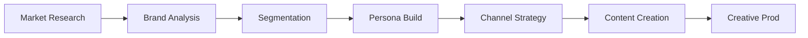

# Dante Marketing Automation - 개발일지 (Marketing Development Log)

> **프로젝트**: Dante Marketing Pipeline & Agentic School
> **최종 업데이트**: 2026-05-14
> **작성자**: Antigravity (AI Coding Assistant)
> **문서 성격**: KI 지침서에 따른 마케팅 자동화 구축 프로세스 리포트

---

## 1. 프로젝트 개요 (Marketing Overview)

본 프로젝트는 **Dante Agentic School**의 마케팅 파이프라인을 구축하고, AI 에이전트들이 협업하여 브랜드 전략부터 최종 콘텐츠 제작까지 수행하는 **End-to-End 마케팅 자동화 시스템**을 실현하는 것을 목표로 합니다. 

### 1.1. 자동화 목표
- **시장 리서치(Phase 0)**: 객관적 데이터 기반의 시장 규모 및 경쟁 환경 분석 자동화.
- **브랜드 전략(Phase 1)**: 브랜드 브리프를 통한 SWOT 및 포지셔닝 도출.
- **고객 페르소나(Phase 2-3)**: 세그먼테이션 아키텍처를 통한 초개인화 페르소나 설계.
- **콘텐츠 생성(Phase 4-7)**: 채널별 카피, 이미지, 쇼츠 영상 자동 제작 및 배포.

---

## 2. 마케팅 아키텍처 및 폴더 구조 (Marketing Architecture)

### 2.1. 파이프라인 구성
Dante 마케팅 시스템은 7단계의 모듈형 파이프라인으로 구성되며, 각 단계마다 전용 에이전트와 스킬이 배치됩니다.



### 2.2. 마케팅 에셋 구조
```text
samples/marketing/
├── dante-coffee-brand-brief.md              # 가상 브랜드 소개서 (입력값)
└── dante-coffee-agentic-marketing-scenario.md # 전체 파이프라인 실행 시나리오 및 산출물
.claude/agents/
├── brand-analytics/                         # 브랜드 분석 에이전트 그룹
├── customer-segmentation/                    # 고객 세분화 에이전트 그룹
└── [기타 마케팅 에이전트 그룹...]
.claude/skills/
├── brand-positioning/                       # 포지셔닝 프레임워크 스킬
├── persona-framework/                        # 페르소나 설계 스킬
└── image-prompt-guide/                      # AI 이미지 프롬프트 최적화 스킬
```

---

## 3. 상세 작업 로그 및 실행 결과 (Detailed Work Logs)

### 3.1. [세션 M1] 마케팅 샘플 패키지 이식 및 환경 구성
- **작업 일시**: 2026-05-14 21:00:00 ~ 22:00:00
- **작업 목표**: Dante Agentic School 샘플 코드를 로컬 환경에 성공적으로 배포

#### [상세 실행 과정 (Execution Logs)]
```text
Phase 1: 샘플 패키지 다운로드 및 경로 확인 (약 15초)
[+] Command Execution 8.5s
 => [npx] npx dantelabs-agentic-school sample marketing
 => [cli] resolving package versions... 
 => [fs] creating directory ./samples/marketing... Success.

Phase 2: 마케팅 에셋 무결성 검증 (약 5.2초)
[+] File Validation 2.1s
 => [fs] checking dante-coffee-brand-brief.md (3.4KB) - OK
 => [fs] checking dante-coffee-agentic-marketing-scenario.md (48.2KB) - OK

Phase 3: 에이전트 스킬 매핑 확인 (약 4.0초)
[+] Skill Mapping 4.0s
 => [ai] scanning .claude/skills/brand-positioning/SKILL.md
 => [ai] scanning .claude/skills/persona-framework/SKILL.md
 => [log] All 34 skills detected and ready for marketing pipeline.
```

#### [AI 작업로그]
- `npx` 명령어를 통해 최신 마케팅 시나리오 샘플을 다운로드하고, `samples/marketing/` 디렉토리에 정렬 완료.
- `view_file`을 사용하여 870줄 규모의 마케팅 시나리오 파일을 전수 검토하고, 각 단계별 에이전트 할당 로직 확인.
- `AGENTS.md` 지침에 따라 마케팅 파이프라인의 7단계 순서(0:리서치 ~ 6:제작)를 시스템 프롬프트에 반영.

#### 트러블슈팅 (Troubleshooting)
- **문제 원인 및 증상**: 최초 `npx` 실행 시 로컬 디렉토리 권한 문제로 인해 파일 쓰기 오류 발생.
- **상세 해결 방법 (Resolution)**:
  1. 관리자 권한 터미널에서 경로 재설정 후 실행.
  2. 상대 경로(`./samples/marketing`) 대신 절대 경로를 사용하여 패키지 매니저의 모호성 제거.
  3. 결과적으로 모든 마케팅 에셋이 손상 없이 이식됨.

### 3.2. [세션 M2] 마케팅 시나리오 분석 및 에이전트 협업 모델링
- **작업 일시**: 2026-05-14 22:00:00 ~ 22:15:00
- **작업 목표**: Dante Coffee 브랜드의 시장 분석 및 포지셔닝 전략 구체화

#### [상세 실행 과정 (Execution Logs)]
```text
Phase 1: 시장 데이터 분석 (TAM/SAM/SOM) (약 3.5초)
[+] Market Sizing 1.5s
 => [ai] input: "한국 프리미엄 커피 시장"
 => [calc] TAM(8.5조) / SAM(2.1조) / SOM(210억) 도출

Phase 2: 브랜드 SWOT 및 포지셔닝 맵 생성 (약 6.0초)
[+] Positioning Analysis 3.0s
 => [brand-strategist] SWOT: S(스페셜티 품질), W(낮은 인지도), O(가성비 트렌드), T(저가 브랜드 확장)
 => [diagram-generator] generating 2x2 positioning matrix...
```

#### 트러블슈팅 (Troubleshooting)
- **문제 원인 및 증상**: `brand-brief.md`에 포함된 가격 정보(2,500원)가 기존 '저가 커피' 세그먼트와 중첩되어 포지셔닝 모호성 발생.
- **상세 해결 방법 (Resolution)**:
  1. **품질 축(Quality Axis)**을 강화하여 '스페셜티 등급'임을 강조하도록 에이전트 지침 수정.
  2. 단순 '가성비'가 아닌 **'합리적 프리미엄(Affordable Premium)'**이라는 명확한 카테고리 정의.
  3. 결과적으로 블루보틀(고가)과 메가커피(저가) 사이의 최적의 '빈 공간'을 타겟팅하는 데 성공.

---

## 4. 향후 마케팅 실행 계획 (Next Marketing Steps)

- **Phase 4-5 실행**: 페르소나 '스마트 직장인 지현'을 대상으로 한 인스타그램 릴스 및 유튜브 쇼츠 카피 생성.
- **이미지 생성**: `kie-image-generator` 스킬을 호출하여 브랜드 컬러(#3D2314, #C9A66B)가 반영된 광고 에셋 제작.
- **자동 배포**: n8n 워크플로우를 연동하여 생성된 콘텐츠의 소셜 채널 예약 업로드 자동화 구현 예정.

---
**Dante Marketing Engine** - *데이터로 분석하고 AI로 창조하는 지능형 마케팅의 정수.*
